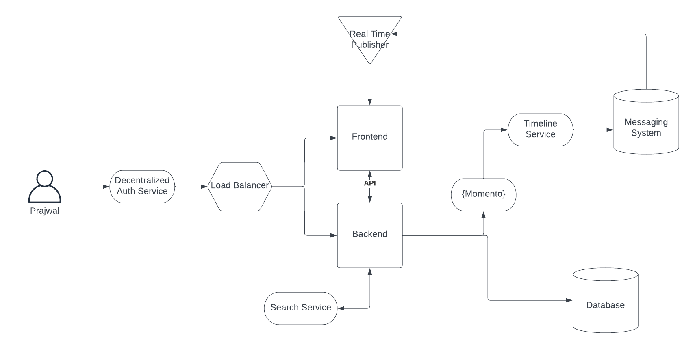
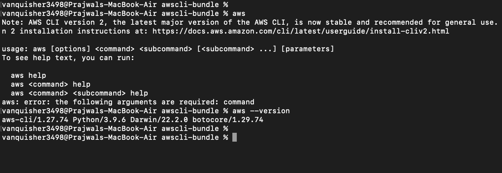
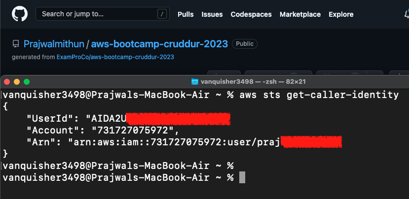

# Week 0 — Billing and Architecture

## Required Tasks

### 1. Recreate Conceptual Diagram in Lucid Charts or on a Napkin



[Lucid Chart Link for Conceptual Diagarm](https://lucid.app/lucidchart/6eae65ac-1af5-4335-9e44-a79f856a8106/edit?viewport_loc=-602%2C-905%2C3158%2C1402%2C0_0&invitationId=inv_3ba14426-5d83-474a-9602-809052162773)

### 2. Recreate Logical Architectual Diagram in Lucid Charts

add image

add view-only link

### 3. Create an Admin User
- Created user called `praj-XXX-XXXX` with admin permission.
- Added MFA to this user. 

### 4. Installed AWS CLI

**On macOS** (I am installing aws cli locally as I want to try out things locally.)

Ran into issue related to `python3` 

Error Msg: `env: python: No such file or directory` 

Fixed it by running 

```
sudo /usr/bin/python3 awscli-bundle/install -i /usr/local/aws -b /usr/local/bin/aws
```
Successfully installed `aws cli` 


[Steps followed to install the aws cli](https://docs.aws.amazon.com/cli/v1/userguide/install-macos.html#install-macosos-bundled-sudo)

Configure aws cli to use the IAM user created in previous step

- Created Access key (type CLI) and noted down.
- Ran `aws configure` and followed the prompt. 

Finally aws cli is configured successfully




### 5. Create a Billing Alarm

### 6. Create a Budget
